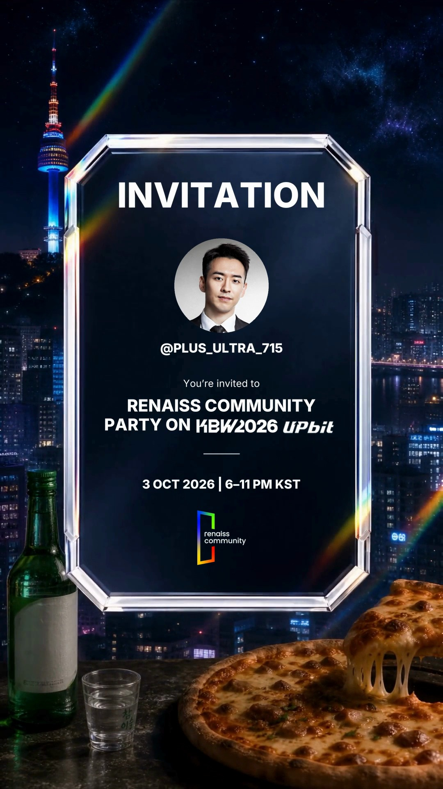

# Renaiss Invitation Template

隊友可以用 X handle、自己的頭像，或 CSV 名單，產生個人化直式 invitation MP4。

固定輸出 **1080 × 1920、30 fps、8.93 秒**。保留原片正面卡框及原始音軌；最後 0.1 秒畫面拉長到 3 秒，音訊不拉長、不額外淡出。名字及主要文字由字體重新渲染，頭像使用獨立原圖，並非放大舊預覽片。



## 1. 安裝

需要 Python 3.9+ 和 FFmpeg（包括 ffprobe）。macOS 可用 `brew install ffmpeg`；Ubuntu 可用 `sudo apt install ffmpeg`；Windows 安裝 FFmpeg 後把 bin 加入 PATH。

```sh
git clone https://github.com/pphc-harry/renaiss-invitation-template.git
cd renaiss-invitation-template
python3 -m venv .venv
source .venv/bin/activate
python -m pip install -r requirements.txt
```

Windows 使用 `py -m venv .venv` 及 `.venv\Scripts\activate`，其餘 `python` 指令相同。Private repo 需要 Harry 授予 GitHub 存取權。

## 2. 立即試做（不需要網絡或 API key）

```sh
python invitation.py --handle Plus_Ultra_715 --avatar examples/winchman.jpg
```

影片：`output/Invitation_Plus_Ultra_715_1080p.mp4`。最後畫面：`output/qa/Plus_Ultra_715.png`。驗證紀錄：`output/qa/Plus_Ultra_715.json`。

## 3. 製作新邀請

只提供 handle，會透過第三方公開 FxTwitter profile API 取得頭像：

```sh
python invitation.py --handle harryinhk
```

公開 API 可能限流、無法讀取帳號，或只提供細圖；失敗不會用其他人的頭像代替。最穩定做法是指定本機頭像：

```sh
python invitation.py --handle new_recipient --avatar /path/to/avatar.png
```

X handle 限 1–15 個英文字母、數字或底線；畫面沿用原設計大階字。建議頭像至少 400 × 400。圓形裁切會取中央。

## 4. 批量產生

複製 `examples/recipients.csv`，一人一行。欄位是 `handle,avatar_path,avatar_url`。頭像優先順序：本機路徑 → HTTPS URL → 公開 profile。相對路徑以 **CSV 所在資料夾** 計算；完全離線使用時，每行填入 `avatar_path`。

```sh
python invitation.py --csv examples/recipients.csv --output output/team --workers 2
```

同名輸出預設不覆蓋；要重出請加 `--overwrite`。每批成功後產生 `manifest.json`。失敗時指令傳回非零狀態，不會將缺少的影片列為成功；修正來源後可加 `--overwrite` 重跑。

## 5. 修改文字及品牌素材

`template.json` 定義文字、位置、字級、頭像區域及標誌 PNG。日期、時間及活動名稱以這份檔案為準；本 repo 沒有替你查證活動資料。可複製 config 後使用 `--config your-template.json`。

`assets/background.mp4` 是 8.93 秒的正面卡框底片。`assets/original.mp4` 供複製原音軌。若要更換背景或影片時長，需要同步修改程式的固定時間及驗證值，不能只替換檔案。

**品牌素材：** 已用 Harry 在 2026-09-26 提供的 `invitation_logo.zip` 替換 `assets/kbw.png`、`assets/upbit.png`、`assets/renaiss-mark.png`。三張均保留原始 PNG 及透明背景；渲染時裁走透明留白、按原比例縮放並置中，避免 Upbit 留白令圖案過小或 logo 被拉伸。

**解像度限制仍在：** KBW 為 191 × 36、Upbit 為 138 × 73（有效圖案 89 × 24）、Renaiss 為 109 × 123。透明背景及缺失圖案問題已解決，但這些不是高清原圖，放大不會增加細節。影片仍輸出 1080 × 1920；每次 QA JSON 的 `brand_marks` 會列出來源尺寸、有效圖案尺寸、顯示尺寸及 `below_display_resolution`。細頭像另以 `avatar_below_display_resolution` 標記。日後可換入更高解像度的透明 PNG，保持 config 顯示區域不變。

上一批錯誤的白底附件只保留於 [`assets/supplied/2026-09-26/`](assets/supplied/2026-09-26/README.md) 作來源紀錄，不會用於渲染。

## 驗證

每次輸出自動檢查全片解碼、1080 × 1920、268 幀、30 fps，並比對原始音訊封包 SHA-256。長 handle 自動縮字，文字超出安全區會停止。亦會輸出末段畫面，請人工確認頭像、名字、活動內容及淡入效果。

```sh
python -m unittest discover -s tests -v
```

不含公司登入資訊、大使命冊、私人 profile 記錄或 Drive 上載憑證。字體 Inter 隨附 SIL Open Font License；活動影片、品牌圖和示例頭像只供獲授權的 Renaiss 團隊使用，沒有授予第三方再分發權。詳見 `docs/ASSETS.md`。

## 文字出場時間

`template.json` 的 `timing.start` 為 4.933333 秒，`fade_duration` 為 0.4 秒；約第 5 秒開始出字，5.333333 秒完全顯示。此修正將 v3 的 5.933333 秒出場提早 1 秒。
